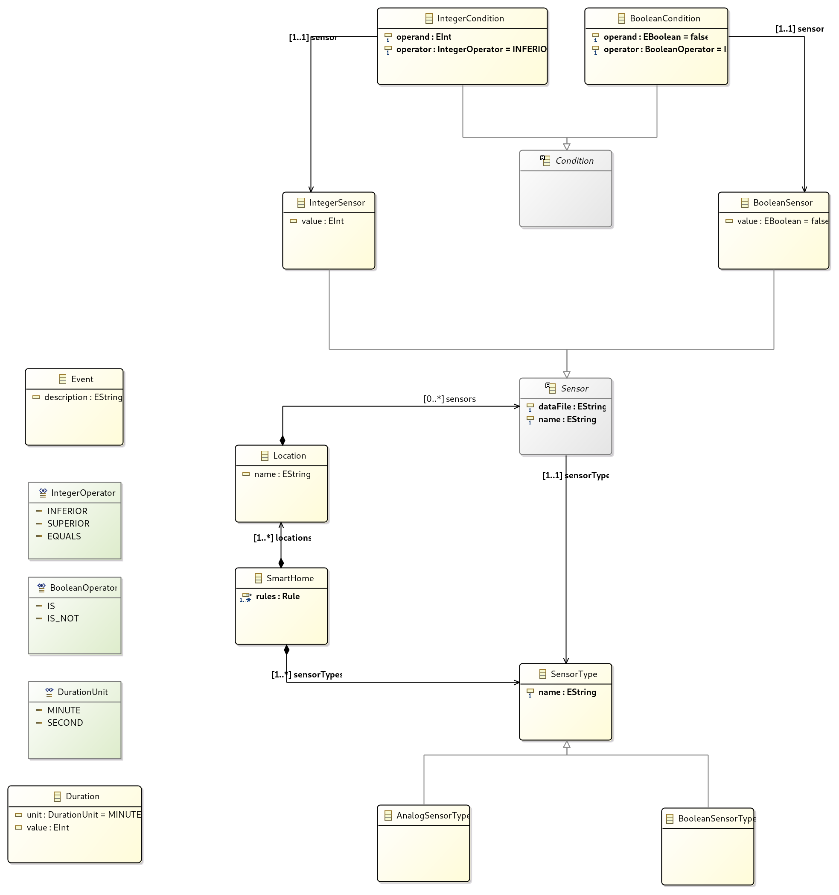

# Interprétation des Langages

## Smart Home Data Fusion DSL

### Setup du projet

#### Installation

- Ouvrir le dossier `smart_house` en tant que workspace Eclipse
- File → Import → Existings projects
- Sélectionner le dossier `smart_house`

#### Lancement de l'exemple

- Lancer la configuration Eclipse `SmartHome Runtime Eclipse` présente dans le dossier `smart_house/fr.unice.polytech.idm.language/launch_configuration`
- Dans le _runtime Eclipse_, importer le projet `TestProject` présent dans le dossier `runtime-EclipseXtext`
- Lancer la configuration Eclipse `SmartHome launch test program` présente dans le dossier `runtime-EclipseXtext/TestProject`

**Note :**
Pour que l'exemple fonctionne, il faut insérer pour chaque capteur le fichier contenant les données qu'il envoie.
Des fichiers d'exemple sont présents dans le dossier `custom-dataset` à la racine du projet.

##### Exemple :

```
IntegerSensor temp1 TEMPERATURE ("")
```

Devient :
```
IntegerSensor temp1 TEMPERATURE ("<chemin>/temp1.csv")
```

### Description du projet

#### Fonctionnalités disponibles

Une maison possède plusieurs pièces, qui elles-mêmes possèdent plusieurs capteurs de différentes natures :
- des capteurs renvoyant des valeurs entières (comme la température ou l'humidité par exemple)
- des capteurs renvoyant des valeurs booléennes (comme une présence par exemple)

Les types de capteurs sont déclarés par l'utilisateur de la manière suivante :

- Dans le cas où le capteur nous renvoie une valeur entière :
```
analog TEMPERATURE
```

- Dans le cas où le capteur nous renvoie une valeur booléenne :

```
boolean PRESENCE
```

Il est possible de déclarer des règles, qui peuvent évaluer plusieurs conditions. Textuellement, ceci pourrait être :

_Si le capteur de température de la chambre m'indique qu'il fait moins de 10°C et qu'il y a quelqu'un à l'intérieur, et que cette situation dure depuis au moins 10 minutes, alors cette personne a froid._

#### Modèle



La `SmartHome` possède :
- une liste de `Location` : les pièces de la maison, qui contiennent chacune plusieurs `Sensor`
- une liste de `Rule` : les règles définies par l'utilisateur, qui contiennent chacun plusieurs `Condition`, ainsi que l'`Event` déclenché dès que la règle devient vraie
- une liste de `SensorType` : les types de capteurs définis par l'utilisateur

`SensorType` est hérité par deux classes, correspondant aux deux types de sensors :
- `AnalogSensorType`
- `BooleanSensorType`

Ces deux types sont utilisés respectivement dans deux sous-classes de `Sensor` :
- `IntegerSensor`
- `BooleanSensor`

Chaque `Condition` représente une comparaison entre la valeur d'un capteur et une valeur décidée par l'utilisateur dans la définition d'une règle.
Une `Condition` permet de comparer des entiers ou des booléens.
```
"kitchen.temperature" < 10
"bedroom.presence" is true
```
Ceci est rendu possible grâce à l'héritage (`IntegerCondition` et `BooleanCondition`).
Ces deux sous-classes contiennent respectivement un `IntegerOperator` et un `BooleanOperator`.
